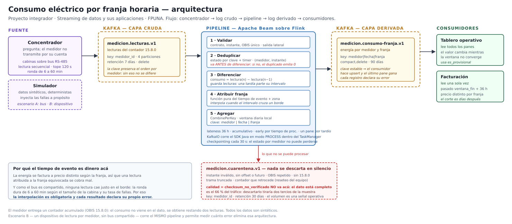

## Resumen

⚠️ PENDIENTE · *los tres, al final* — Media página. Qué problema se resuelve, qué se
construyó y cuál es el resultado medible. Se escribe **último**, cuando los números ya están.

---

# 1. El problema y para quién

Una distribuidora eléctrica necesita **facturar a precio diferenciado según la hora**: no
cuesta lo mismo un kWh en hora punta que de madrugada. Para eso hace falta saber cuánta
energía consumió cada cliente **en cada franja**, y ahí empiezan las dificultades.

## 1.1 Por qué el dato no está disponible

Los medidores de este parque **no transmiten por su cuenta ni guardan una serie histórica**:
responden con el valor actual de sus contadores cuando se les pregunta. Tres hechos de esa
recolección determinan todo lo demás:

| Hecho | Consecuencia |
|---|---|
| El registro `15.8.0` es un **contador acumulado** | El consumo no viene en el dato: se obtiene **restando dos lecturas** |
| Los medidores de una cabina comparten un **bus RS-485** y se leen en secuencia | Ninguna lectura cae justo en el borde de una franja; la ronda dura de 6 a 60 minutos |
| El concentrador **pierde enlace** y publica después lo que juntó | Las lecturas llegan tardías, fuera de orden y en ráfagas |

Hoy el sistema pide **una vez por día**, lo que alcanza para facturar el consumo diario y no
para discriminar por franja. Habilitar la tarifa horaria exige pedir en cada borde, y ese es
el cambio que este trabajo modela.

## 1.2 El giro: el tiempo de evento es dinero

En la mayoría de los pipelines, la distinción entre *tiempo de evento* y *tiempo de
procesamiento* es una sutileza técnica. **Acá no.** Una lectura atribuida a la franja
equivocada se factura a un precio equivocado, y el error no es aleatorio: se concentra en las
cabinas grandes y de peor enlace, que son las que más tardan en completar una ronda.

Eso convierte una decisión de diseño en un requisito de negocio, y es la razón de que toda la
política temporal del sistema esté justificada y no simplemente elegida.

## 1.3 Quién usa el resultado

Dos consumidores del mismo tópico, con necesidades opuestas:

| | **Tablero operativo** | **Facturación** |
|---|---|---|
| Qué lee | Todos los panes de cada celda | Un solo valor por celda |
| Cuándo | Continuamente | Pasado `ventana_fin + 36 h` |
| Qué tolera | Que el número cambie mientras la ventana no converge | Nada: necesita un valor estable |
| Qué habilita | Ver la demanda por franja mientras el día transcurre | Emitir la factura con el precio correcto por franja |

Esa diferencia es la que justifica el modo **acumulativo** con salida por *upsert*: cada pane
es la revisión completa de la celda, así que el tablero puede mostrar el último y la
facturación puede leer una sola vez sin reconstruir nada.

## 1.4 Qué mide el sistema, además del consumo

Un resultado que el trabajo produce y que no estaba en la consigna: **cada registro de salida
declara su propio error de atribución**, derivado de la separación entre las dos lecturas que
rodean el borde de la franja. El sistema no solo entrega un número, entrega cuánto se puede
confiar en él — y eso permite cuantificar cuánto costaría, en dinero mal facturado, la
arquitectura de recolección actual frente a una con un dispositivo por medidor.

# 2. Arquitectura



El flujo es **concentrador → log crudo → pipeline → log derivado → consumidores**, con una
salida lateral a cuarentena. Cada componente está donde está por una razón:

**El simulador** ocupa el lugar del concentrador. Genera datos sintéticos y deterministas, y
existe para **inyectar fallas a propósito**: pedidos que se corren, cabinas que caen enteras,
tramas truncadas, duplicados y ráfagas tardías. Un simulador que se porta bien no sirve para
demostrar que el pipeline tolera lo que tiene que tolerar.

**Kafka en dos capas.** El tópico crudo conserva las lecturas tal como llegaron, claveadas por
medidor para que su orden se preserve — sin ese orden, la etapa de diferenciación no puede
restar lecturas consecutivas. El tópico derivado lleva el resultado, claveado por la celda que
identifica, de modo que recalcular reemplace en lugar de duplicar.

**El pipeline sobre Beam y Flink** hace cinco cosas en orden, y **el orden no es
intercambiable**: la deduplicación va antes de la diferenciación porque, si no, un duplicado
se restaría contra sí mismo y produciría un consumo de cero que, con salida por *upsert*,
pisaría el valor correcto.

**La cuarentena** recibe todo lo que no se puede procesar, contado y con su motivo. Su volumen
es una señal operativa: si sube en una zona, el problema es la cobertura de red y no el
pipeline.

## 2.1 El detalle que condiciona el despliegue

`KafkaIO` **no es una librería Python**: es una transformación *cross-language* cuyas etapas
de lectura y escritura ejecuta el SDK de **Java**. La imagen de Flink empaqueta los dos SDK y
los corre en modo `PROCESS` dentro del TaskManager, lo que evita tener que darle al contenedor
acceso al demonio de Docker. Está documentado en [`infra/README.md`](../../infra/README.md).

# 3. Contrato de eventos y topología de Kafka

⚠️ PENDIENTE · *Clara* — **es casi transcripción**: `contratos.md` §1 ya lo tiene resuelto

> Lo que pide el enunciado: **contrato de eventos, tópicos, claves, particiones y esquema de
> salida.**

Lo que no puede faltar, porque son las decisiones que se defienden:

- Por qué `medidor_id` como clave y no `cabina_id` — el desbalance de 200× → `contratos.md` §1.2.
- Por qué 4 particiones, y por qué el criterio **no** es el throughput de escritura.
- La estrategia de evolución del esquema, que el enunciado pide explícitamente → §1.3.
- **La bandera de calidad que no significa corrupción** → §1.5. Es el hallazgo más fuerte que
  tenemos: descartar por esa bandera tiraría dos tercios de la muestra.

# 4. Tiempo de evento, ventanas y datos tardíos

⚠️ PENDIENTE · *Clara*

> Lo que pide el enunciado: **ventanas, lateness, y la política de datos tardíos.**

- Ventana diaria alineada al día local, y por qué la franja **no** es una ventana → decisión 6.
- Lateness de 36 h, con el razonamiento de por qué no 24 ni 48 → `contratos.md` §2.4.
- Triggers, panes y modo acumulativo, con lo que se resigna en el trigger tardío.
- **El error de atribución**, que es el resultado central: sale de la duración de la ronda, y
  la ronda la fija la tasa de fallas y no la velocidad → decisión 5.

# 5. Confiabilidad: duplicados, idempotencia y garantías

## 5.1 Dos reintentos que no producen lo mismo

Es la distinción de la que depende no descartar datos buenos:

| Reintento | Qué produce | Quién lo maneja |
|---|---|---|
| **De comunicación** — se vuelve a pedir al medidor | Una lectura **nueva**, en un instante posterior. **No es un duplicado** | La lógica de franja, tolerando que la lectura no esté donde se la esperaba |
| **De publicación** — se vuelve a publicar a Kafka | Un **duplicado real**: mismo instante, mismo valor | La deduplicación |

Tratar el primero como duplicado descartaría una medición legítima.

## 5.2 Deduplicación, y por qué va antes de diferenciar

Clave: **`(medidor_id, instante_lectura)`**, que es exactamente lo que resume el `event_id`
determinista. Horizonte: **36 horas**, el mismo que la lateness — si el estado expirara antes,
un tardío legítimo volvería a parecer nuevo y se contaría dos veces.

El orden respecto de la diferenciación **no es intercambiable**:

```
1.ª vez:   consumo = R₂ − R₁       ✔
2.ª vez:   consumo = R₂ − R₂ = 0   ✘   y con upsert, ese 0 pisa el valor correcto
```

Hay una prueba con `TestStream` que fija este orden, de modo que nadie pueda invertirlo sin
que la suite falle.

## 5.3 La salida idempotente

El pipeline **no puede evitar reintentar**: un timeout de escritura no dice si la escritura
llegó. Por eso la idempotencia tiene que estar en la **forma de la salida** y no en no
reintentar.

La clave `medidor|fecha|franja` identifica la **celda del resultado**, no el intento de
escritura. Todos los panes de una celda comparten clave, van a la misma partición, se leen en
orden y **el último gana**. Recalcular una ventana reemplaza su valor en lugar de sumar otro,
y eso es lo que hace que el replay converja al mismo resultado.

## 5.4 El upsert no alcanza: un intervalo superado no puede seguir sumando

La clave anterior resuelve los reintentos de escritura, pero **no** el caso de la lectura
tardía, y conviene separarlos porque se parecen.

Cuando llega una tardía, la diferenciación parte el intervalo que la contenía y emite las dos
mitades. El intervalo grosero ya salió, y Beam Python no tiene retractaciones. El *upsert* no
lo retira, porque opera sobre la **celda** y los tres intervalos caen dentro de la misma celda.
Con `ACCUMULATING`, la agregación los suma a los tres:

| Intervalo | Energía |
|---|---|
| 08:00 → 09:00 | 6 kWh |
| 08:00 → 08:30 | 2 kWh |
| 08:30 → 09:00 | 4 kWh |
| **Suma** | **12 kWh**, el doble del consumo real |

La regla que lo corrige: los intervalos de un medidor parten la línea de tiempo, y cada uno
queda identificado por su **borde izquierdo**. Partirlo exige una lectura interior, que acerca
el borde derecho — un intervalo solo puede **acortarse**. Entre varios que empiezan en el mismo
instante, **el vigente es el más corto**.

Es función pura del dato, no del orden de llegada, y por eso un *replay* converge al mismo
resultado. Con la regla alternativa —«el último que llegó»— haría falta un orden que en un
reproceso no existe.

**Este error lo encontró una prueba, no una ejecución.** Con datos ideales no aparece nunca:
hace falta una lectura tardía, que es exactamente el escenario adverso que el enunciado pide
demostrar y la razón por la que una corrida feliz no es evidencia.

## 5.5 Qué garantiza el sistema, y dónde termina

Declarado por tramo, sin sobreprometer:

| Tramo | Garantía | Por qué |
|---|---|---|
| Concentrador → Kafka | **Al menos una vez** | El productor reintenta ante un fallo de publicación; puede duplicar |
| Dentro del pipeline | **Efectivamente una vez** dentro del horizonte de 36 h | Deduplicación con estado por clave, respaldada por el checkpointing de Flink |
| Pipeline → salida | **Efectivamente una vez** en el efecto observable | El *upsert* por clave estable hace que reescribir sea inocuo |

**No se afirma exactly-once de punta a punta**, y conviene decir por qué: fuera del horizonte
de 36 horas la deduplicación no garantiza nada, porque el estado ya expiró. Un duplicado que
llegara al tercer día se contaría de nuevo. Es una decisión consciente — mantener el estado
indefinidamente no es una opción sobre una entrada no acotada — y el límite queda declarado en
lugar de escondido.

## 5.6 Un consumo negativo nunca es válido

En el mercado modelado no hay compra de energía al usuario, así que el contador solo puede
subir. Una resta negativa es un **reseteo del equipo** o una **trama truncada**, nunca una
medición: va a cuarentena.

Esa regla es además la segunda defensa contra el caso más peligroso del dominio — una trama
cortada en medio de un número, que deja un valor plausible que ninguna validación de formato
detecta.

# 6. Pruebas y evidencia

⚠️ PENDIENTE · *los tres*

> Lo que pide el enunciado: **pruebas de lógica y de tiempo, escenarios adversos, y
> demostración del recorrido completo.**

- Pruebas unitarias: 34 del simulador, 23 de franjas.
- Pruebas con `TestStream`: duplicado, tardío dentro de tolerancia, tardío fuera, desorden.
- **La prueba de humo**, que recorre simulador → Kafka → Beam → Kafka → `infra/README.md`.
- **El contraste A/B**: el mismo pipeline, sin cambiar una línea, contra las dos arquitecturas
  de recolección. Convierte el error de atribución de estimación en medición.

# 7. Límites, supuestos y posibles mejoras

## 7.1 Supuestos declarados

| Supuesto | En qué se apoya |
|---|---|
| **No hay compra de energía al usuario** | Es un rasgo del marco regulatorio modelado, no una simplificación nuestra. Sin inyección remunerada, `15.8.0` equivale a energía consumida |
| **Un consumo negativo es siempre un reseteo** | Se desprende del anterior: sin exportación, el contador no baja |
| **No rige horario de verano** | Evita días con franjas de duración distinta. Si volviera, la configuración tendría que contemplarlos |
| **Ningún medidor acumula por franja** | No es una simplificación: es incompatible con que las franjas sean configurables, porque un cambio de calendario obligaría a reconfigurar el parque en campo |

## 7.2 Límites conocidos

**La tasa de fallas no está calibrada.** Las mediciones disponibles muestran la *forma* de
cada caso —la distribución de duraciones es trimodal, la escalera de reintentos es
determinista— pero **no permiten estimar con qué frecuencia** ocurre cada uno. Es el parámetro
más influyente del modelo, y el error de atribución que el sistema reporta depende de él.

**La correlación por modelo de equipo es invisible para este pipeline.** Con el mismo enlace,
las tasas de entrega por modelo van de 65 % a 94 %, y como los modelos están repartidos por
todo el parque esa correlación es **espacialmente dispersa**: ninguna partición por ubicación
la aísla. Un pipeline particionado por medidor o por cabina no puede verla. Es el límite más
interesante que encontramos, porque hay una estructura real en los datos que la clave de
particionamiento elegida no alcanza.

**Un evento perdido arruina dos intervalos, no uno.** Si falta la lectura de las 18:15, no se
puede calcular el consumo de 18:00–18:15 *ni* el de 18:15–18:30: el primero pierde su final y
el segundo su inicio.

**Un pane por evento tardío.** La ráfaga de una cabina que vuelve de una caída produce una
escritura por lectura. En producción convendría agrupar los disparos tardíos, a costa de
demorar la corrección unos minutos — algo que a la facturación no le cambia nada. Se eligió la
versión por evento **para que la corrección sea visible en la demostración**.

**Fuera de las 36 horas no hay deduplicación**, como se explica en §5.5.

## 7.3 Posibles mejoras

**Un dispositivo de lectura por medidor.** Elimina de raíz la limitación de fondo, que es el
bus compartido. Y su justificación económica **sale de este mismo trabajo**: el error de
atribución que el pipeline mide hoy es exactamente lo que esa inversión ahorraría. El
simulador genera ese escenario y el **mismo pipeline, sin cambios**, lo procesa — así la
comparación es una medición y no una estimación.

Si se hace, conviene que el dispositivo exponga sus parciales en **códigos OBIS propios** y no
en los registros tarifarios estándar: permite leer el total del medidor y los parciales del
dispositivo y **verificar que sumen**, de modo que un dispositivo desincronizado se detecte
solo.

**Reducir la pausa entre medidores.** Un tercio del tiempo por medidor es una pausa fija que
el concentrador aplica, y es una decisión de implementación, no del protocolo. Es el parámetro
más barato de mejorar de todos los que aparecen en este análisis.

**Medición neta.** Si se introdujera compra de energía al usuario, habría que leer `1.8.0` y
`2.8.0` por separado y la regla del consumo negativo dejaría de valer.

**Una materialización intermedia** para el tablero, si alguna vez hacen falta consultas
ad-hoc o muchos lectores concurrentes.

# 8. Integrantes y contribuciones

⚠️ PENDIENTE · *los tres*

> Lo que pide el enunciado: **lista de integrantes y contribuciones principales de cada
> persona.**

| Integrante | Contribución principal |
|---|---|
| Sergio Morel | ⚠️ completar |
| Clara Almirón | ⚠️ completar |
| Daniel Ramírez | ⚠️ completar |

El historial de git lo respalda: `git shortlog -sn --no-merges`.
