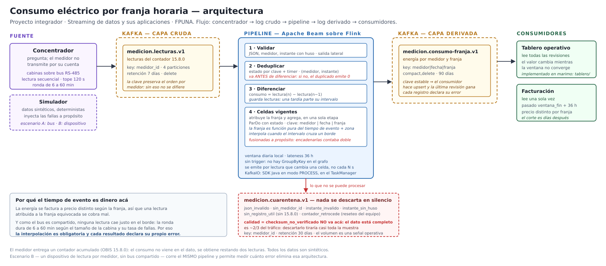

## Resumen

⚠️ PENDIENTE · *los tres, al final* — Media página. Qué problema se resuelve, qué se
construyó y cuál es el resultado medible. Se escribe **último**, cuando los números ya están.

---

# 1. El problema y para quién

Una distribuidora eléctrica necesita **facturar a precio diferenciado según la hora**: no
cuesta lo mismo un kWh en hora punta que de madrugada. Para eso hace falta saber cuánta
energía consumió cada cliente **en cada franja**, y ahí empiezan las dificultades.

## 1.1 Por qué el dato no está disponible

Los medidores de este parque **no transmiten por su cuenta ni guardan una serie histórica**:
responden con el valor actual de sus contadores cuando se les pregunta. Tres hechos de esa
recolección determinan todo lo demás:

| Hecho | Consecuencia |
|---|---|
| El registro `15.8.0` es un **contador acumulado** | El consumo no viene en el dato: se obtiene **restando dos lecturas** |
| Los medidores de una cabina comparten un **bus RS-485** y se leen en secuencia | Ninguna lectura cae justo en el borde de una franja; la ronda dura de 6 a 60 minutos |
| El concentrador **pierde enlace** y publica después lo que juntó | Las lecturas llegan tardías, fuera de orden y en ráfagas |

Hoy el sistema pide **una vez por día**, lo que alcanza para facturar el consumo diario y no
para discriminar por franja. Habilitar la tarifa horaria exige pedir en cada borde, y ese es
el cambio que este trabajo modela.

## 1.2 El giro: el tiempo de evento es dinero

En la mayoría de los pipelines, la distinción entre *tiempo de evento* y *tiempo de
procesamiento* es una sutileza técnica. **Acá no.** Una lectura atribuida a la franja
equivocada se factura a un precio equivocado, y el error no es aleatorio: se concentra en las
cabinas grandes y de peor enlace, que son las que más tardan en completar una ronda.

Eso convierte una decisión de diseño en un requisito de negocio, y es la razón de que toda la
política temporal del sistema esté justificada y no simplemente elegida.

## 1.3 Quién usa el resultado

Dos consumidores del mismo tópico, con necesidades opuestas:

| | **Tablero operativo** | **Facturación** |
|---|---|---|
| Qué lee | Todos los panes de cada celda | Un solo valor por celda |
| Cuándo | Continuamente | Pasado `ventana_fin + 36 h` |
| Qué tolera | Que el número cambie mientras la ventana no converge | Nada: necesita un valor estable |
| Qué habilita | Ver la demanda por franja mientras el día transcurre | Emitir la factura con el precio correcto por franja |

Esa diferencia es la que justifica el modo **acumulativo** con salida por *upsert*: cada pane
es la revisión completa de la celda, así que el tablero puede mostrar el último y la
facturación puede leer una sola vez sin reconstruir nada.

## 1.4 Qué mide el sistema, además del consumo

Un resultado que el trabajo produce y que no estaba en la consigna: **cada registro de salida
declara su propio error de atribución**, derivado de la separación entre las dos lecturas que
rodean el borde de la franja. El sistema no solo entrega un número, entrega cuánto se puede
confiar en él — y eso permite cuantificar cuánto costaría, en dinero mal facturado, la
arquitectura de recolección actual frente a una con un dispositivo por medidor.

# 2. Arquitectura



El flujo es **concentrador → log crudo → pipeline → log derivado → consumidores**, con una
salida lateral a cuarentena. Cada componente está donde está por una razón:

**El simulador** ocupa el lugar del concentrador. Genera datos sintéticos y deterministas, y
existe para **inyectar fallas a propósito**: pedidos que se corren, cabinas que caen enteras,
tramas truncadas, duplicados y ráfagas tardías. Un simulador que se porta bien no sirve para
demostrar que el pipeline tolera lo que tiene que tolerar.

**Kafka en dos capas.** El tópico crudo conserva las lecturas tal como llegaron, claveadas por
medidor para que su orden se preserve — sin ese orden, la etapa de diferenciación no puede
restar lecturas consecutivas. El tópico derivado lleva el resultado, claveado por la celda que
identifica, de modo que recalcular reemplace en lugar de duplicar.

**El pipeline sobre Beam y Flink** hace cinco cosas en orden, y **el orden no es
intercambiable**: la deduplicación va antes de la diferenciación porque, si no, un duplicado
se restaría contra sí mismo y produciría un consumo de cero que, con salida por *upsert*,
pisaría el valor correcto.

**La cuarentena** recibe todo lo que no se puede procesar, contado y con su motivo. Su volumen
es una señal operativa: si sube en una zona, el problema es la cobertura de red y no el
pipeline.

## 2.1 El detalle que condiciona el despliegue

`KafkaIO` **no es una librería Python**: es una transformación *cross-language* cuyas etapas
de lectura y escritura ejecuta el SDK de **Java**. La imagen de Flink empaqueta los dos SDK y
los corre en modo `PROCESS` dentro del TaskManager, lo que evita tener que darle al contenedor
acceso al demonio de Docker. Está documentado en [`infra/README.md`](../../infra/README.md).

# 3. Contrato de eventos y topología de Kafka

> Borrador escrito por Sergio a partir de [`contratos.md`](../contratos.md) §1–§2, que es de
> Clara. Pendiente de su revisión.

## 3.1 El evento de entrada

**Tópico** `medicion.lecturas.v1` · **clave** `medidor_id` · **4 particiones**.

```json
{
  "schema_version": 1,
  "event_id": "0c12196f5ef41988",
  "medidor_id": "MED-0002-000",
  "cabina_id": "CAB-0002",
  "lote_id": "LOTE-CAB-0002-0000",
  "secuencia": 0,
  "instante_lectura": "2026-09-22T00:00:18-03:00",
  "registros": [
    { "obis": "15.8.0", "naturaleza": "acumulado", "valor": 10898.124, "unidad": "kWh" }
  ],
  "calidad": "ok",
  "publicado_at": "2026-09-22T00:00:19.269-03:00"
}
```

Tres campos merecen explicación porque no son obvios:

**`event_id` es determinista**, `sha256("<medidor_id>|<instante_lectura>")[:16]`. Si fuera
aleatorio, un reintento de publicación produciría un id distinto y el duplicado dejaría de ser
reconocible. Es la mitad de la clave de deduplicación.

**`cabina_id` no es decorativo.** La duración de la ronda —y por lo tanto el error de
atribución— es una propiedad **de la cabina**, porque sus medidores comparten un bus RS-485 y
se leen en secuencia. Sin este campo no se distingue «un medidor no contesta» de «se cayó la
cabina entera».

**`publicado_at` contra `instante_lectura`** da el retraso de publicación, que es el insumo de
la observabilidad y lo que justifica el valor de la lateness.

Los registros van como **lista de objetos y no como mapa `código → valor`**, porque la unidad y
la naturaleza son propiedad del registro y no de la lectura: `15.8.0` viene en kWh, pero un
registro de potencia vendría en kW. Con un mapa, esa tabla viviría hardcodeada en el consumidor.
Lo que la lista pierde —un mapa impide por estructura que un código se repita— pasa a ser una
regla que el validador hace cumplir.

## 3.2 Por qué la clave es el medidor y no la cabina

El orden que este caso necesita es **por medidor**, y es un requisito duro: la diferenciación
resta lecturas consecutivas del mismo equipo, así que necesita verlas en secuencia. Kafka
preserva el orden dentro de una partición, y con esta clave todas las lecturas de un medidor
caen siempre en la misma.

`cabina_id` agruparía la ronda, que es tentador, pero las cabinas van de 1 a 199 medidores:
produciría particiones desbalanceadas en un factor de **200**. Con `medidor_id` el reparto es
parejo por construcción.

## 3.3 Cuatro particiones, y por qué el criterio no es el throughput

Aun el caso grande —100.000 medidores en rondas continuas— son unos 9,6 millones de mensajes
por día, que para un broker es poco. Lo que fija el número es otra cosa:

1. **El paralelismo útil está acotado por `min(particiones, slots, claves)`.** El stack corre 2
   TaskManagers con 2 slots. Con 4 particiones hay margen para duplicar los slots sin
   reparticionar, que es una operación que rompe el orden por clave.
2. **El estado vive por clave, no por partición**, así que agregar particiones no alivia
   memoria: solo reparte.
3. **Más particiones alargan la recuperación**, porque releer una partición es serial.

## 3.4 Tópicos, retención y evolución del esquema

| Tópico | Para qué | Clave | Retención |
|---|---|---|---|
| `medicion.lecturas.v1` | Lecturas crudas | `medidor_id` | `delete`, 7 días |
| `medicion.consumo-franja.v1` | Resultado por medidor, día y franja | `medidor\|fecha\|franja` | `compact,delete`, 90 días |
| `medicion.cuarentena.v1` | Todo lo rechazado, con su motivo | `medidor_id` si se conoce | `delete`, 30 días |

La convención es `<dominio>.<sustantivo>.v<mayor>`, y la regla de evolución tiene dos ramas.
Un **cambio compatible** —un campo opcional, un registro OBIS más en la lista— no cambia nada,
porque un consumidor que solo mira `15.8.0` no se entera. Un **cambio incompatible** —quitar o
renombrar un campo, cambiar un tipo o su significado— crea un tópico `.v2`, y los dos conviven
mientras dure la transición.

`schema_version` viaja en **tres lugares** y cada uno tiene su razón: en el nombre del tópico,
para que un consumidor incompatible no se suscriba siquiera; en un header, para decidir sin
deserializar; y en el cuerpo, para que el mensaje sea autodescriptivo cuando se lo mira suelto,
en un archivo o en la cuarentena.

En la salida, `compact,delete` es una combinación deliberada: **`compact` solo nunca borra una
clave**, y como la clave incluye la fecha local, el espacio de claves crecería todos los días
para siempre. La política combinada conserva el último valor de cada clave *y* deja caducar las
viejas.

## 3.5 La bandera de calidad que no significa corrupción

Es el hallazgo más fuerte del análisis del dominio, y el que más plata cambia.

| Valor | Qué significa | Qué hace el pipeline |
|---|---|---|
| `ok` | Trama completa y verificada | Procesa |
| `checksum_no_verificado` | La trama llegó **entera**, pero no se pudo verificar su carácter de control | **Procesa**, y lo cuenta |
| `truncada` | La trama se cortó | Cuarentena |

La lectura ingenua de `checksum_no_verificado` es «dato sospechoso, descartar». Sería un error
caro: **es del orden de dos tercios del tráfico** —medido sobre el simulador, 63,2 % con 8
cabinas— y los datos están completos. Descartarlos tiraría casi toda la muestra. No indica
corrupción sino un equipo cuyo cálculo del carácter de control difiere del que el concentrador
espera, que es una propiedad del **modelo de medidor**, no del estado de la trama.

Y `truncada` **no alcanza como defensa**: una trama cortada en medio de un número
—`014380.81` → `01438`— sigue siendo un número válido y no siempre se marca. Por eso hay una
segunda defensa aguas abajo, en la diferenciación: un contador no baja (§5.6).

## 3.6 El registro de salida

**Tópico** `medicion.consumo-franja.v1` · **clave** `medidor_id|fecha_local|franja`.

La clave **es el contrato**: es estable a través de todos los panes de una misma celda, todos
van a la misma partición, se leen en orden y el último gana. La semántica del consumidor es
**upsert, nunca insert**. No incluye `cabina_id` aunque el campo viaje en el valor, porque un
medidor podría cambiar de cabina y la identidad del resultado no debe depender de eso.

Cada registro **declara su propia incertidumbre**, que es lo que lo hace honesto:
`interpolada` dice si algún borde se estimó en lugar de medirse, `separacion_maxima_minutos`
da la cota del error de atribución, y `minutos_cubiertos` contra la duración de la franja
distingue «consumió poco» de «todavía no llegó todo».

Y hay un límite a lo que se estima. Repartir por interpolación supone potencia constante
durante el intervalo, y eso deja de ser defendible cuando el intervalo dura horas: en `punta`
sabemos que el consumo no es uniforme — es la razón de que la franja exista. Por encima de
**90 minutos** la energía de ese cruce no se reparte: la celda queda `indeterminada` y
`minutos_indeterminados` dice cuánto quedó sin cubrir. El resto de la celda se conserva.

El umbral no se eligió por gusto. La duración de los intervalos que cruzan un borde tiene
**dos modas**: abajo de 90 minutos está la ronda normal, aun una lenta, con el 79 % de los
casos; arriba de 120 está la cabina caída, con el 20 %. Entre medio hay 13 casos de 1.146. El
umbral va en ese valle, porque a cada lado hay un fenómeno distinto — y cortar más abajo
marcaría indeterminado el 42 % de los cruces, casi todos rondas que funcionaron bien.

Sobre la cobertura hay una decisión que vale contar: el borrador anterior proponía
`intervalos_contados` contra `intervalos_esperados`, y **con readout eso no se puede calcular**.
No hay grilla fija de medición, hay rondas continuas cuya duración depende del tamaño de la
cabina, así que no existe un número de intervalos «esperados».

# 4. Tiempo de evento, ventanas y datos tardíos

> Borrador escrito por Sergio a partir de [`contratos.md`](../contratos.md) §2.4 y de las
> decisiones 5, 6 y 8, material de Clara. Pendiente de su revisión.

## 4.1 Cuál es el tiempo de evento, y quién lo pone

El record de Kafka trae **cuándo se publicó**; `instante_lectura` trae **cuándo se midió**.
Entre los dos puede haber horas —es justamente el retraso que justifica la lateness— y
ventanear por el de publicación metería consumo en el día equivocado. El pipeline asigna el
timestamp explícitamente después de parsear.

El instante lo pone el **concentrador**, no el medidor, y esa es una decisión del dominio y no
una comodidad: el modo *readout* no devuelve timestamp, y muchos equipos tienen el reloj mal
configurado o desactualizado. El concentrador sella al recibir la respuesta, lo que traslada el
problema de «miles de relojes dudosos» a «unos pocos relojes que se pueden sincronizar».

## 4.2 La ventana diaria, y por qué hay que desplazarla

**Ventana fija de un día, alineada a la medianoche local.**

Beam ventanea sobre el instante absoluto, así que una `FixedWindows(1 día)` sin desplazar
cortaría a medianoche UTC — **las 21:00 en Asunción, en pleno horario de `punta`**. El corte
caería en el medio de la franja más cara. Se corrige con un desplazamiento de 3 h, que el
pipeline calcula del propio calendario en lugar de tenerlo escrito a mano: si alguien cambia la
zona en la configuración, el desplazamiento la sigue.

**La franja no es una ventana**, y conviene decir por qué se evaluó y se descartó. Una franja
es función pura del tiempo de evento, así que no necesita agrupamiento: se calcula y **viaja en
la clave**. Modelarla como ventana obligaría a redefinir el ventaneo cada vez que cambiara el
calendario tarifario, y el calendario es configuración.

## 4.3 Los 36 horas de lateness

| Alternativa | Por qué no |
|---|---|
| 24 h | Es exactamente la cadencia de recolección, sin margen: cualquier corte que dure un poco más pierde datos |
| 48 h | Duplica el estado sin evidencia de que haga falta |
| **36 h** | Cubre un día entero de caída de enlace con media jornada de margen |

El máximo retraso medido en el corpus fue de **3,97 h**, un orden de magnitud por debajo. La
holgura no es por incertidumbre sobre el caso típico sino por el caso raro: una cabina que
queda incomunicada un día entero.

Ese número es también el horizonte de la deduplicación (§5.2) y el tiempo que vive el estado.
No es coincidencia: si el estado expirara antes, un tardío legítimo volvería a parecer nuevo.

## 4.4 Triggers, panes y acumulación

| Parámetro | Valor | Por qué |
|---|---|---|
| Trigger temprano | `AfterProcessingTime(60 s)` | El tablero tiene que moverse. Más rápido no compra nada: una ronda dura de 20 a 40 min, así que antes de 60 s rara vez hay información nueva |
| Trigger tardío | `AfterCount(1)` | Cada llegada tardía **corrige dinero**, y hace visible el pane correctivo |
| Acumulación | `ACCUMULATING` | Cada pane es la revisión completa de la celda y reemplaza al anterior |

**Lo que se resigna en el trigger tardío:** un pane por evento significa que la ráfaga de una
cabina que vuelve de una caída produce una escritura por lectura. En producción convendría
agrupar los disparos tardíos con `AfterProcessingTime`, a costa de demorar la corrección unos
minutos — algo que a la facturación no le cambia nada, porque se factura días después. Se elige
la versión por evento **para que la corrección sea visible en la demostración**.

**Ningún pane anuncia que es el último.** Después del último tardío simplemente no se emite
nada. La finalidad la deduce el consumidor cuando su reloj pasa `fin_de_ventana + 36 h`, y por
eso hay dos lectores del mismo tópico con patrones distintos: el tablero lee todos los panes y
muestra un valor que cambia; la facturación lee una sola vez, pasado ese horizonte.

## 4.5 La validación va antes del watermark

El orden es una decisión y no un detalle: **un evento se valida antes de participar del avance
del watermark.** Un solo concentrador con el reloj adelantado arrastraría el watermark hacia el
futuro y haría que Beam descartara por tardías las lecturas legítimas **de todos los demás
medidores**. Un dato malo pasaría de arruinar su propia celda a arruinar la ventana entera.

Por eso una lectura sin offset horario va a cuarentena en lugar de interpretarse en la zona del
proceso: si se asumiera la zona local del worker, la franja atribuida dependería de en qué
máquina corre el pipeline.

## 4.6 El error de atribución, que es el resultado central

```
error_atribucion_pct = separacion_maxima_minutos / duracion_franja_minutos
```

Con la franja `punta` de 4 h del calendario de ejemplo y una separación máxima de 38 min, da
**15,9 %**. El número es distinto para cada medidor, porque depende del tamaño de su cabina, y
en el corpus medido va de 16 min en la mediana a **249 min** en el peor caso: una cabina caída.

Lo que hay que entender de ese número es de dónde sale. Los medidores de una cabina comparten
un bus RS-485 y se leen **en secuencia**, así que la separación entre dos lecturas del mismo
equipo la fija la duración de la ronda. Y la duración de la ronda la fija sobre todo **la tasa
de fallas**, no la velocidad del enlace: cada medidor que no contesta cuesta el tiempo de
espera y los reintentos.

De ahí sale la conclusión que el sistema habilita y que no estaba en el enunciado: **para
cobrar por franja horaria, mejorar la confiabilidad de la recolección vale más que acelerarla.**

# 5. Confiabilidad: duplicados, idempotencia y garantías

## 5.1 Dos reintentos que no producen lo mismo

Es la distinción de la que depende no descartar datos buenos:

| Reintento | Qué produce | Quién lo maneja |
|---|---|---|
| **De comunicación** — se vuelve a pedir al medidor | Una lectura **nueva**, en un instante posterior. **No es un duplicado** | La lógica de franja, tolerando que la lectura no esté donde se la esperaba |
| **De publicación** — se vuelve a publicar a Kafka | Un **duplicado real**: mismo instante, mismo valor | La deduplicación |

Tratar el primero como duplicado descartaría una medición legítima.

## 5.2 Deduplicación, y por qué va antes de diferenciar

Clave: **`(medidor_id, instante_lectura)`**, que es exactamente lo que resume el `event_id`
determinista. Horizonte: **36 horas**, el mismo que la lateness — si el estado expirara antes,
un tardío legítimo volvería a parecer nuevo y se contaría dos veces.

El orden respecto de la diferenciación **no es intercambiable**:

```
1.ª vez:   consumo = R₂ − R₁       ✔
2.ª vez:   consumo = R₂ − R₂ = 0   ✘   y con upsert, ese 0 pisa el valor correcto
```

Hay una prueba con `TestStream` que fija este orden, de modo que nadie pueda invertirlo sin
que la suite falle.

## 5.3 La salida idempotente

El pipeline **no puede evitar reintentar**: un timeout de escritura no dice si la escritura
llegó. Por eso la idempotencia tiene que estar en la **forma de la salida** y no en no
reintentar.

La clave `medidor|fecha|franja` identifica la **celda del resultado**, no el intento de
escritura. Todos los panes de una celda comparten clave, van a la misma partición, se leen en
orden y **el último gana**. Recalcular una ventana reemplaza su valor en lugar de sumar otro,
y eso es lo que hace que el replay converja al mismo resultado.

## 5.4 El upsert no alcanza: un intervalo superado no puede seguir sumando

La clave anterior resuelve los reintentos de escritura, pero **no** el caso de la lectura
tardía, y conviene separarlos porque se parecen.

Cuando llega una tardía, la diferenciación parte el intervalo que la contenía y emite las dos
mitades. El intervalo grosero ya salió, y Beam Python no tiene retractaciones. El *upsert* no
lo retira, porque opera sobre la **celda** y los tres intervalos caen dentro de la misma celda.
Con `ACCUMULATING`, la agregación los suma a los tres:

| Intervalo | Energía |
|---|---|
| 08:00 → 09:00 | 6 kWh |
| 08:00 → 08:30 | 2 kWh |
| 08:30 → 09:00 | 4 kWh |
| **Suma** | **12 kWh**, el doble del consumo real |

La regla que lo corrige: los intervalos de un medidor parten la línea de tiempo, y cada uno
queda identificado por su **borde izquierdo**. Partirlo exige una lectura interior, que acerca
el borde derecho — un intervalo solo puede **acortarse**. Entre varios que empiezan en el mismo
instante, **el vigente es el más corto**.

Es función pura del dato, no del orden de llegada, y por eso un *replay* converge al mismo
resultado. Con la regla alternativa —«el último que llegó»— haría falta un orden que en un
reproceso no existe.

**Y hay una segunda trampa, del mismo error.** La primera corrección fue descartar los
superados con un `CombinePerKey` y dejar la agregación por celda detrás. Estaba mal igual:
**encadenar dos agregaciones bajo un trigger `ACCUMULATING` cuenta doble**, porque cada pane
de la primera llega a la segunda como un elemento nuevo y la segunda lo suma otra vez.

| Pane | Resultado |
|---|---|
| 1 | 6 kWh ✔ |
| 2 | 12 kWh ✘ — y es el que vale, porque el último gana |

Por eso las dos etapas son **una sola**, con estado y sin `GroupByKey`: `process` corre una vez
por elemento, no una vez por pane. Emite el **valor absoluto** de cada celda que cambia, de
modo que el destino sea un *upsert* puro.

**Los dos errores los encontraron pruebas, no ejecuciones.** Ninguno aparece con datos ideales:
el primero necesita una lectura tardía, el segundo además necesita que la ventana dispare dos
veces. Son exactamente los escenarios adversos que el enunciado pide demostrar, y la razón por
la que una corrida feliz no es evidencia.

## 5.5 Qué garantiza el sistema, y dónde termina

Declarado por tramo, sin sobreprometer:

| Tramo | Garantía | Por qué |
|---|---|---|
| Concentrador → Kafka | **Al menos una vez** | El productor reintenta ante un fallo de publicación; puede duplicar |
| Dentro del pipeline | **Efectivamente una vez** dentro del horizonte de 36 h | Deduplicación con estado por clave, respaldada por el checkpointing de Flink |
| Pipeline → salida | **Efectivamente una vez** en el efecto observable | El *upsert* por clave estable hace que reescribir sea inocuo |

**No se afirma exactly-once de punta a punta**, y conviene decir por qué: fuera del horizonte
de 36 horas la deduplicación no garantiza nada, porque el estado ya expiró. Un duplicado que
llegara al tercer día se contaría de nuevo. Es una decisión consciente — mantener el estado
indefinidamente no es una opción sobre una entrada no acotada — y el límite queda declarado en
lugar de escondido.

## 5.6 Un consumo negativo nunca es válido

En el mercado modelado no hay compra de energía al usuario, así que el contador solo puede
subir. Una resta negativa es un **reseteo del equipo** o una **trama truncada**, nunca una
medición: va a cuarentena.

Esa regla es además la segunda defensa contra el caso más peligroso del dominio — una trama
cortada en medio de un número, que deja un valor plausible que ninguna validación de formato
detecta.

# 6. Pruebas y evidencia

El enunciado fija la vara: *«una ejecución exitosa con datos ideales no es evidencia
suficiente»*. Por eso la evidencia está partida en tres piezas con propósitos distintos.

## 6.1 La demostración narrada

`uv run python -m pipeline.demostracion` cuenta una historia de cinco lecturas sobre **un
solo medidor**, elegida para que cada paso se verifique con una resta mental. Corre con
`DirectRunner` y `TestStream`, sin Docker: el tiempo se controla, así que la salida es
idéntica en cualquier máquina — que es lo que la vuelve evidencia y no anécdota.

Las lecturas del contador, en kWh acumulados, rodean el borde de las 18:00 donde empieza
`punta`:

| Acto | Qué llega | Qué debe pasar |
|---|---|---|
| 1 | 17:40 → 100,0 · 17:55 → 101,5 · 18:20 → 105,5 | Dos intervalos; el segundo cruza el borde y se reparte por interpolación |
| 2 | Otra vez 17:55 → 101,5 | **Nada cambia.** Es un reintento de publicación |
| 3 | Tardía: 18:00 → 102,4 | Parte el intervalo y **corrige** el reparto estimado |

Y lo que efectivamente sale:

| Celda | Acto 1 y 2 | Acto 3 | Diferencia |
|---|---|---|---|
| `MED-0042\|2026-09-25\|resto` | 2,300 *interpolado* | 2,400 *medido* | +0,100 |
| `MED-0042\|2026-09-25\|punta` | 3,200 *interpolado* | 3,100 *medido* | −0,100 |
| **Total** | **5,500** | **5,500** | **0** |

Hay tres cosas para leer ahí, y son las tres que el enunciado pide ver.

**El duplicado no movió la tabla.** No apareció ningún intervalo de 0 kWh pisando un valor
bueno, que es lo que pasaría si se deduplicara después de diferenciar (§5.2).

**La tardía corrigió el reparto sin cambiar el total.** Medir con más detalle no crea ni
destruye energía: solo cambia a qué franja se le atribuye. La columna de origen pasa de
*interpolado* a *medido*, porque la lectura cayó justo sobre el borde y ya no hubo nada que
estimar.

**Los 0,100 kWh son el error de atribución**, el número que el proyecto existe para medir. No
es un defecto del pipeline: viene de que el intervalo cruzaba el borde y hubo que suponer
potencia constante. La tardía es la que revela cuánto se erró.

La demostración verifica sus propias afirmaciones y devuelve código de salida, y está
cubierta por la suite: si se rompe, el video que la muestra deja de ser reproducible.

## 6.2 Las pruebas automáticas

76 en total, y la división importa:

| Suite | Cuántas | Qué fija |
|---|---|---|
| Simulador | 34 | Determinismo por semilla, inyección de fallas, curva de consumo |
| Franjas | 29 | Validación del calendario, atribución, reparto por borde, conservación de la energía |
| `TestStream` | 10 | Duplicado, desorden, contador que retrocede, cuarentena, orden de las etapas |
| Demostración | 3 | Que la evidencia de §6.1 siga saliendo como está escrita acá |

Las de `TestStream` son las que no se pueden escribir de otra forma: el comportamiento tardío
depende de dónde está el watermark, y con un reloj real habría que esperar y el resultado
dependería de la máquina.

Dos merecen mención porque fijan decisiones que alguien podría deshacer sin darse cuenta:

- `test_el_duplicado_debe_deduplicarse_antes_de_diferenciar` — el orden de las dos etapas.
- `test_la_tardia_no_puede_contarse_dos_veces` — que el intervalo superado deje de sumar.

## 6.3 El recorrido completo sobre Kafka y Flink

Son dos pruebas, y la separación es deliberada.

`pipeline.humo` verifica **el cableado** con un *passthrough*: que KafkaIO levanta, que Flink
acepta el trabajo, que los bytes entran y salen. Sin lógica de dominio de por medio, separa
«el pipeline está mal» de «la infraestructura está mal», que son dos problemas distintos.

`pipeline.extremo_a_extremo` responde la pregunta que ninguna de las otras responde: **¿la
lógica da lo mismo cuando la ejecuta Flink?** No es retórica. El runner portable serializa las
funciones y el estado hacia procesos que no comparten memoria con el que arma el pipeline, y
hay cosas que andan en `DirectRunner` y no allá. Siembra las mismas cinco lecturas de §6.1 y
exige el mismo resultado:

```
  celda                                   kWh   esperado  origen
  MED-0042|2026-09-25|punta             3.100      3.100  medido ✔
  MED-0042|2026-09-25|resto             2.400      2.400  medido ✔
  TOTAL                                 5.500      5.500
```

Dos detalles que la corrida deja ver y que valen como evidencia por sí solos. La **cuarentena
quedó vacía**, así que nada se perdió por el camino. Y el tópico de salida recibió **cinco
mensajes para dos celdas**: son las revisiones sucesivas, una por cada lectura que cambió algo,
y el *upsert* del consumidor se queda con las dos últimas. Es la semántica del contrato
funcionando sobre el stack real, no sobre una maqueta.

Usa tópicos propios (`medicion.*.e2e`) para que cada corrida sea independiente: compartir los
de producción hacía que leyera lo que había dejado la prueba anterior. Comandos en
[`infra/README.md`](../../infra/README.md).

## 6.4 Un error que solo una prueba podía encontrar

Vale la pena contarlo porque es el argumento del enunciado comprobado sobre el propio código.

La agregación sumaba el intervalo grosero **junto con** las dos mitades que lo reemplazan:
`6 + 2 + 4 = 12` kWh, el doble del consumo real, sobre un dato que se factura. Se creía que
el *upsert* lo resolvía, y no: opera sobre la celda, y los tres intervalos caen dentro de la
misma celda (§5.4).

Lo que más enseña es que **la primera corrección también estaba mal**, y que tampoco se veía.
Descartar los superados en una etapa y sumar en la siguiente vuelve a duplicar, porque dos
agregaciones encadenadas bajo `ACCUMULATING` se suman entre sí. Apareció recién al conectar la
cadena a Kafka y probarla con una ventana que dispara dos veces.

Con datos ideales ninguno de los dos aparece. El primero necesita una lectura tardía; el
segundo, además, que la ventana dispare más de una vez.

# 7. Límites, supuestos y posibles mejoras

## 7.1 Supuestos declarados

| Supuesto | En qué se apoya |
|---|---|
| **No hay compra de energía al usuario** | Es un rasgo del marco regulatorio modelado, no una simplificación nuestra. Sin inyección remunerada, `15.8.0` equivale a energía consumida |
| **Un consumo negativo es siempre un reseteo** | Se desprende del anterior: sin exportación, el contador no baja |
| **No rige horario de verano** | Evita días con franjas de duración distinta. Si volviera, la configuración tendría que contemplarlos |
| **Ningún medidor acumula por franja** | No es una simplificación: es incompatible con que las franjas sean configurables, porque un cambio de calendario obligaría a reconfigurar el parque en campo |

## 7.2 Límites conocidos

**La tasa de fallas no está calibrada.** Las mediciones disponibles muestran la *forma* de
cada caso —la distribución de duraciones es trimodal, la escalera de reintentos es
determinista— pero **no permiten estimar con qué frecuencia** ocurre cada uno. Es el parámetro
más influyente del modelo, y el error de atribución que el sistema reporta depende de él.

**La correlación por modelo de equipo es invisible para este pipeline.** Con el mismo enlace,
las tasas de entrega por modelo van de 65 % a 94 %, y como los modelos están repartidos por
todo el parque esa correlación es **espacialmente dispersa**: ninguna partición por ubicación
la aísla. Un pipeline particionado por medidor o por cabina no puede verla. Es el límite más
interesante que encontramos, porque hay una estructura real en los datos que la clave de
particionamiento elegida no alcanza.

**Un evento perdido arruina dos intervalos, no uno.** Si falta la lectura de las 18:15, no se
puede calcular el consumo de 18:00–18:15 *ni* el de 18:15–18:30: el primero pierde su final y
el segundo su inicio.

**Un pane por evento tardío.** La ráfaga de una cabina que vuelve de una caída produce una
escritura por lectura. En producción convendría agrupar los disparos tardíos, a costa de
demorar la corrección unos minutos — algo que a la facturación no le cambia nada. Se eligió la
versión por evento **para que la corrección sea visible en la demostración**.

**Fuera de las 36 horas no hay deduplicación**, como se explica en §5.5.

## 7.3 Posibles mejoras

**Un dispositivo de lectura por medidor.** Elimina de raíz la limitación de fondo, que es el
bus compartido. Y su justificación económica **sale de este mismo trabajo**: el error de
atribución que el pipeline mide hoy es exactamente lo que esa inversión ahorraría. El
simulador genera ese escenario y el **mismo pipeline, sin cambios**, lo procesa — así la
comparación es una medición y no una estimación.

Si se hace, conviene que el dispositivo exponga sus parciales en **códigos OBIS propios** y no
en los registros tarifarios estándar: permite leer el total del medidor y los parciales del
dispositivo y **verificar que sumen**, de modo que un dispositivo desincronizado se detecte
solo.

**Reducir la pausa entre medidores.** Un tercio del tiempo por medidor es una pausa fija que
el concentrador aplica, y es una decisión de implementación, no del protocolo. Es el parámetro
más barato de mejorar de todos los que aparecen en este análisis.

**Medición neta.** Si se introdujera compra de energía al usuario, habría que leer `1.8.0` y
`2.8.0` por separado y la regla del consumo negativo dejaría de valer.

**Una materialización intermedia** para el tablero, si alguna vez hacen falta consultas
ad-hoc o muchos lectores concurrentes.

# 8. Integrantes y contribuciones

⚠️ PENDIENTE · *los tres*

> Lo que pide el enunciado: **lista de integrantes y contribuciones principales de cada
> persona.**

| Integrante | Contribución principal |
|---|---|
| Sergio Morel | ⚠️ completar |
| Clara Almirón | ⚠️ completar |
| Daniel Ramírez | ⚠️ completar |

El historial de git lo respalda: `git shortlog -sn --no-merges`.
